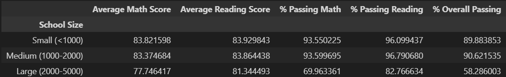

# pandas-challenge
## Andrew Lounsbury
Module 4 Pandas challenge for the Vanderbilt Data Analytics Bootcamp

# Code from Stack Overflow
The cell 
```
# Use `pd.cut` to categorize spending based on the bins.
# https://stackoverflow.com/questions/75808415/why-am-i-getting-typeerror-not-supported-between-instances-of-int-and-st
# We're trying to compare the integer bins to the budgets, which have dollar signs in them, making them strings. To avoid this, we take just the numbers in the string with .str[1:], and convert just that portion to a float. Then the comparison works. 
school_spending_df["Spending Ranges (Per Student)"] = pd.cut(school_spending_df["Per Student Budget"].str[1:].astype(float), bins=spending_bins, labels=labels)
school_spending_df
```
contains some code taken from [this page](https://stackoverflow.com/questions/75808415/why-am-i-getting-typeerror-not-supported-between-instances-of-int-and-st). 

# Charts
## The Initial Data Set

## District Summary

## School Summary

## Highest Performing Schools

## Bottom Performing Schools

## Math Scores by Grade

## Reading Scores by Grade

## Scores by School Spending

## Scores by School Size

## Scores by School Type


# Report
* Overall, Charter schools greatly outperformed District schoools with Charter schools having an overall passing percentage of 90.43% and District schools having an overall passing percentage of 53.67%. 
* The school with the lowest number of students, Holden High School, had a high percent passing math (92.51%), an even higher percent passing reading (96.25%), and a relativley high percent overall passing (89.23%) despite its low spending rate per student (<585). 
* The school with the highest number of students had a low overall passing percentage (54.64%) despite having a higher spending range per student ($585-630) than Holden High School. 